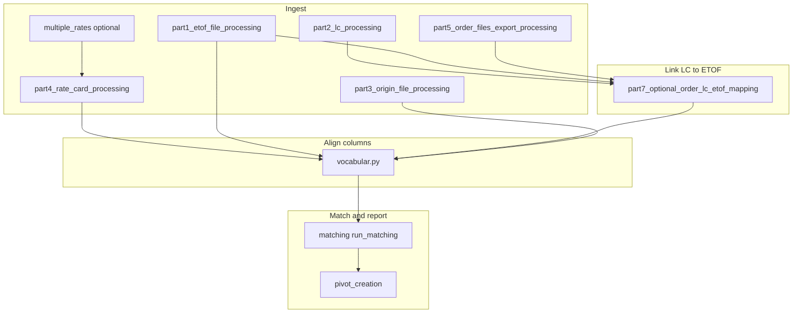

# CANF / Combined Result — Project Overview

This document describes the **end-to-end** structure of the workspace at `combined result`: what each major script does, **recommended execution order**, **inputs and outputs**, **shipper-specific behavior**, and how the pieces connect. The primary runnable pipeline lives under the **`test folder`** directory.

---

## 1. What this project is

**CANF** (“Compare and Find”) is a Python workflow that:

1. Ingests **logistics / rating** inputs: rate cards (Excel), shipment tables (**ETOF** Excel), optional **LC** order XML, optional **origin** files, and optional **order-files export**.
2. Optionally **links** LC rows to ETOF rows (order file names, shipment IDs, delivery numbers, or LC # / ETOF # keys).
3. **Normalizes column names** across sources using a **vocabulary / semantic mapping** step (rate card is the naming standard).
4. **Matches** each shipment row to rate-card lanes, evaluates **conditions** and **business rules**, and builds **discrepancy comments**.
5. Produces **Excel outputs** (matched shipments, rate card reference, pivot summaries) and optional **Google Drive** packaging.

The main **user-facing** entry point is **`test folder/result.py`**, which launches a **Gradio** web UI (suited for local use or Google Colab).

---

## 2. Directory layout (high level)

| Location | Role |
|----------|------|
| **`test folder/`** | All main Python modules: `part1`–`part7`, `vocabular.py`, matching, pivot, Gradio app, utilities. |
| **`test folder/input/`** (created at runtime or mirrored) | Relative **`input/`** is resolved from the **current working directory** when scripts run; `result.py` copies uploads into `input/` next to the script. |
| **`test folder/output/`** | Default location for **`Result.xlsx`** (copy of final matching workbook). |
| **`test folder/partly_df/`** | Intermediate Excel/text artifacts (vocabulary mapping, LC–ETOF mapping debug exports, column mapping log). |
| **`input/`** (repo root) | Sample and real XML/Excel inputs used for offline tests (not always the same path the UI uses). |
| **`test folder/additional_pythons/`** | Older or step-wise scripts (`step1.py` … `step5.py`, `Result_new.py`, `debug.py`) used for comparisons; not the primary Gradio path. |
| **`test folder/additional_files/`** | Text diffs comparing legacy steps vs current parts. |

---

## 3. Recommended pipeline order (conceptual)

Scripts are designed to be run **in this logical order**. In practice, **`result.py`** runs a subset of these steps automatically after staging files into `input/`.



**Notes:**

- **Part 4 (rate card)** can be satisfied by a **single** Excel rate card *or* by a **pre-merged** workbook **`rate_card_modified.xlsx`** produced by **`multiple_rates.py`**.
- **Part 7** only applies when **LC + ETOF** are both available (and optionally order export).
- **`vocabular.py`** must run **before** matching so that **`partly_df/vocabulary_mapping.xlsx`** exists (matching reads it).

---

## 4. Module-by-module reference

### 4.1 `test folder/part1_etof_file_processing.py` — ETOF Excel

**Purpose:** Load an **ETOF** workbook from **`input/<filename>`**, normalize geography columns, drop editor columns, optionally enrich from mismatch reports.

**Main APIs:**

| Function | Description |
|----------|-------------|
| `configure_enrichment(shipper_id, mismatch_report_paths)` | Sets **globals** `SHIPPER_ID` and `MISMATCH_REPORT_PATHS` used by `process_etof_file`. |
| `process_etof_file(file_path)` | Returns `(DataFrame, column_names)`. Reads Excel with **`skiprows=1`**, renames duplicated “Country/Postal/Airport/City/Seaport” pairs to **Origin*** vs **Destination***, strips country codes from `"XX - Name"` strings, drops columns like Match/Approve/Currency/Value variants. |
| `enrich_etof_with_shipment_id(...)` | For shipper **`iffdgf`**: maps **`ETOF #`** → **`SHIPMENT_ID`** via mismatch report columns **`ETOF_NUMBER`**, **`SHIPMENT_ID`**. |
| `enrich_etof_with_service(...)` | For shipper **`apple`**: maps **`ETOF #`** → **`SERVICE_ISD`** and overwrites **`Service`** in ETOF. |
| `save_dataframe_to_excel(...)` | Writes to **`partly_df/`**. |

**Inputs:** Path **relative to `input/`** (e.g. `etof_file.xlsx`).

**Customization:** Enrichment runs only when **`configure_enrichment`** was called **and** `shipper_id` / mismatch paths are set.

---

### 4.2 `test folder/part2_lc_processing.py` — LC / ISD XML

**Purpose:** Discover **LC\*.xml** (and, when scanning folders, **`find_lc_xml_files`** also accepts **`ISD*.xml`**), parse each **`<ORDER>`** block into one DataFrame row.

**Main APIs:**

| Function | Description |
|----------|-------------|
| `find_lc_xml_files(folder_path, recursive=False)` | Returns sorted full paths of XML files whose names start with **`LC`** or **`ISD`** (case-insensitive). |
| `create_dataframe_from_xml_files(file_paths)` | Flatten child tags under each ORDER; adds **`filename`**. |
| `process_lc_input(input_path, recursive=False)` | Accepts a **file**, **folder**, or **list** of paths under `input/`; returns `(df, column_names)`. **Single-file** branch only accepts names starting with **`LC`** and ending with **`.xml`** (stricter than folder scan). |
| `save_dataframe_to_excel(...)` | Writes to **`partly_df/`**. |

**Inputs:** `input/`-relative paths to XML files or folders.

---

### 4.3 `test folder/part3_origin_file_processing.py` — Origin CSV / Excel / EDI (XML)

**Purpose:** Load supplemental **origin** shipment or reference files with configurable header row and column slice; special path for **`.edi`** treated as XML via `process_edi_file`.

**Main API:** `process_origin_file(file_path, header_row=None, end_column=None)`  
- For **`.xlsx`/`.csv`**: **`header_row`** is **1-based** (Excel style); converted to pandas `header=header_row-1`.  
- **`end_column`**: 1-based last column index (inclusive logic via `iloc`).  
- **`.edi`**: uses XML flattening; `header_row` ignored.

**Outputs:** `(DataFrame, column_names)`; optional saves via `save_dataframe_to_excel`.

---

### 4.4 `test folder/part4_rate_card_processing.py` — Rate card Excel

**Purpose:** Load the commercial **rate card**: lane rows, **font-based** filtering (black-font mandatory columns), **Conditions** sheet text, and **Business Rules** sections (postal zones, country regions, etc.).

**Important behavior:**

- Standard path: read sheet **`Rate card`** with **`skiprows=2`**, detect first real data column, use **openpyxl** font colors to keep **mandatory** columns.
- If **`rate_card_modified`** appears in the **filename** (typically **`input/rate_card_modified.xlsx`**), the module uses **pre-built** sheets **`Rate Card Data`**, **`Conditions`**, **`Business Rules`** (see `multiple_rates.py`).

**Exports (conceptually):** `process_rate_card` returns **`(df, column_names, conditions_dict)`**; other helpers (`process_business_rules`, `get_business_rules_lookup`, `find_business_rule_columns`, `get_required_geo_columns`, etc.) support **vocabular** and **matching**.

---

### 4.5 `test folder/part5_order_files_export_processing.py` — Order files export

**Purpose:** Minimal extractor: keeps only **`Order file #`** and **`Order file name`** from an Excel export.

**Main API:** `process_order_files_export(file_path)` → DataFrame.

Used by **part7** to align LC **`ORIG_FILE_NAME`** with internal order numbers.

---

### 4.6 `test folder/part7_optional_order_lc_etof_mapping.py` — LC ↔ ETOF linking

**Purpose:** Produce an **LC-side** DataFrame that includes identifiers needed later for vocabulary and matching: **`LC #`**, **`ETOF #`**, and optionally **`SHIPMENT_ID`** / delivery-based keys.

**Key functions:**

| Function | Role |
|----------|------|
| `fuzzy_match_filename` | Match LC **`ORIG_FILE_NAME`** to order export **`Order file name`** (normalize extension, fuzzy cutoff **0.7**). |
| `map_order_file_to_lc` | Adds **`Order file #`** to LC rows when order export is used. |
| `map_etof_to_lc` | Adds **`ETOF #`**; renames **`Order file #`** → **`LC #`** when applicable. **Priority:** **`SHIPMENT_ID`** in both ETOF and LC if present; else **delivery number** columns (several naming variants); else **LC #** on ETOF matched to **Order file #** on LC. Handles **multi-value** delivery strings (split on comma/semicolon). |
| `process_order_lc_etof_mapping(lc_input_path, etof_path, order_files_path=None)` | Orchestrates LC load → optional order mapping → ETOF load → `map_etof_to_lc`; saves **`order_lc_etof_mapping.xlsx`** or **`lc_etof_mapping.xlsx`** under **`partly_df/`**. |

**Dependencies:** `part2`, `part5`, `part1`.

---

### 4.7 `test folder/multiple_rates.py` — Combine several rate cards

**Purpose:** When a shipper has **multiple** Excel rate cards with **identical mandatory columns**, merge them into one logical file for the rest of the pipeline.

**Main APIs:**

- `validate_mandatory_columns(file_paths)` — ensures black-font column sets match.  
- `process_multiple_rate_cards(...)` — concatenates data, merges **conditions** and **business rules**.  
- **`save_combined_rate_cards(...)`** — writes default **`input/rate_card_modified.xlsx`** with sheets: **`Rate Card Data`**, **`Conditions`**, **`Business Rules`**, **`Summary`**.

**Interaction:** `part4_rate_card_processing.process_rate_card` auto-detects **`rate_card_modified`** by substring in the path.

**Gradio note:** `result.py` warns if **multiple** rate cards are uploaded without pre-merge; it expects **`rate_card_modified.xlsx`** in `input/` for that scenario.

---

### 4.8 `test folder/vocabular.py` — Column vocabulary and renaming

**Purpose:** Build a **mapping from each source’s column names → rate card column names**, then **rename** ETOF / LC / Origin frames to that shared vocabulary. Writes **`partly_df/vocabulary_mapping.xlsx`** and a text log (default **`column_mapping_results.txt`** in `partly_df/` per `save` helpers).

**Main APIs:**

| Function | Description |
|----------|-------------|
| `set_current_shipper(shipper_id)` | Sets **`CURRENT_SHIPPER_ID`** for shipper-specific normalization (e.g. **Apple** port wording). |
| `create_vocabulary_dataframe(...)` | Core mapping table with **`Mapping_Method`** (semantic vs fuzzy vs rules). |
| **`map_and_rename_columns(...)`** | **Primary entry**: processes rate card, optional ETOF/LC/Origin, applies **`ignore_rate_card_columns`**, writes Excel output for matching to consume. Returns **`(etof_renamed, lc_renamed, origin_renamed)`**. |

**Matching technology:**

- Prefers **`sentence_transformers`** + **`sklearn`** cosine similarity when installed (`all-MiniLM-L6-v2`).  
- Falls back to **fuzzy** string similarity (`difflib.SequenceMatcher`) if ML stack missing.

**Notable custom rules (non-exhaustive):**

- Large dictionaries mapping **postal**, **country**, **flow type / category**, **port / POL / POE** synonyms to canonical concepts used in similarity.  
- **`shipper_id.lower() == 'apple'`** in `normalize_for_semantics`: maps **port of loading / port of entry** phrasing toward **origin/destination airport** style tokens.  
- **`shipper_id.lower() == 'dairb'`** in `map_and_rename_columns`: renames origin column **`SHAI Reference`** → **`SHIPMENT_ID`** when present.  
- Business-rule columns on the rate card are detected and **excluded from blind semantic matching** (handled separately in matching).

---

### 4.9 `test folder/matching_new.py` — Shipment vs rate card matching (core engine)

**Purpose:** Load standardized shipment sheets from **`partly_df/vocabulary_mapping.xlsx`**, load the rate card via **`part4`**, align on **common columns**, evaluate **cell-level conditions** and **business-rule geography**, and write discrepancy **`comment`** text per row.

**Main API:** **`run_matching(rate_card_file_path=None)`**

**Typical flow inside `run_matching`:**

1. **`process_rate_card(rate_card_file_path)`** — lanes + conditions.  
2. **`load_business_rules_for_matching`** — structured lookups for geo rules.  
3. Read **`vocabulary_mapping.xlsx`** — expects sheets for **ETOF**, **LC**, **Origin** (presence depends on earlier steps); **prefers LC over ETOF** when both exist (see module docstring).  
4. **`match_shipments_with_rate_card`** — heavy logic: normalization (`normalize_value`), candidate lane search, condition parsing (`parse_condition`, `value_satisfies_condition`), business rule validation (`validate_business_rule`, `find_matching_business_rule_by_geo`).  
5. Writes **`Matched_Shipments_with.xlsx`** (and **`matching_debug.txt`** when debug tee is enabled) under the working directory / script directory as implemented.

**Alternate copy:** **`matching_github.py`** appears to be a sibling / variant of the same CANF matcher (similar header docstring); **`matching_new.py`** is the file inspected in detail for `run_matching` and line counts.

---

### 4.10 `test folder/pivot_creation.py` — Pivot / Google Sheets–style summary

**Purpose:** Post-process **`Matched_Shipments_with.xlsx`**: read **`Matched Shipments`** sheet, split multi-line **`comment`** into rows, **`clean_comment_line`** to normalize wording (strip specific quoted values for aggregation), group by **Carrier** + **Cause of CANF**, add **Amount** counts, optional **Shipper Value**, and write **`Pivot Data`** sheet back into the **same** workbook (preserving existing sheets). Applies optional **openpyxl** header styling.

**Main API:** `update_canf_file(matching_output_file=None, shipper_value=None)`.

---

### 4.11 `test folder/result.py` — Gradio orchestration (main app)

**Purpose:** Single entry that:

1. Adjusts **`sys.path`** for Colab/local (`setup_python_path`).  
2. **`run_full_workflow_gradio(...)`**: copies uploads into **`input/`** beside the script, **`os.chdir(script_dir)`**, runs processing and mapping, then matching and pivot.

**UI inputs (Gradio):**

| Input | Required? | Notes |
|-------|-------------|--------|
| Rate card(s) | Optional in code validation; UI text says optional | Multiple cards: expects pre-merged **`rate_card_modified.xlsx`** in `input/`. |
| ETOF | **Required** | Copied to `etof_file.xlsx` (preserves extension). |
| LC files | Optional | Accumulator only keeps names starting with **`LC`** and ending with **`.xml`** (ISD-only uploads via UI may be excluded). |
| Origin | Optional | Triggers header row / end column fields. |
| Order files export | Optional | Excel/CSV. |
| **Shipper ID** | **Required** | Drives mismatch enrichment and vocabular custom logic. |
| Mismatch report(s) | Optional | Passed to **`configure_enrichment`**. |
| Ignore rate card columns | Optional | Comma-separated column names passed to **`map_and_rename_columns`**. |

**Processing order inside `run_full_workflow_gradio`:**

1. Optional **`configure_enrichment`** + **`process_etof_file`**.  
2. **`process_lc_input`** if LC paths exist.  
3. **`process_origin_file`** if origin exists.  
4. **`process_rate_card`** — prefers **`input/rate_card_modified.xlsx`** if present.  
5. **`process_order_lc_etof_mapping`** if **both** LC list and ETOF exist.  
6. **`vocabular.map_and_rename_columns`** with chosen rate card path.  
7. **`from matching import run_matching`** — see **Section 6** (module naming).  
8. **`pivot_creation.update_canf_file`**.  
9. Copy final **`Matched_Shipments_with.xlsx`** → **`output/Result.xlsx`**, or emit a small **status** workbook if matching output missing.

**Launch:** `python result.py` creates `input/` and `output/`, then **`demo.launch(...)`** (Colab uses `0.0.0.0`, local uses `127.0.0.1`).

---

### 4.12 `test folder/upload_to_drive.py` — Package run for Google Drive

**Purpose:** Interactive CLI (or programmatic args) to create a dated folder **`{Name} {Shipper} {dd.mm.yyyy}`** under a configured Drive path, copy **`partly_df`**, **`input`**, **`output`**, and save an optional **comment txt**.

**Configuration:** `GOOGLE_DRIVE_PATH` (default **`My Drive/CANF Reports`**).  
**Colab:** mounts **`/content/drive`**; **local:** assumes Drive sync client paths.

---

### 4.13 Utility scripts

| File | Role |
|------|------|
| **`cleaning.py`** | `clean_folder`, `clean_input_and_output_folders` — wipe **`input`**, **`output`**, **`partly_df`** contents next to the script. |
| **`updating.py`**, **`find.py`**, **`test.py`** | Ancillary / exploratory scripts (not re-documented here line-by-line). |
| **`additional_pythons/step*.py`** | Legacy incremental pipeline used to generate **`additional_files/comparison_*.txt`**. |

---

## 5. Inputs and outputs (summary table)

### 5.1 Typical inputs (placed under `input/`)

| Asset | Formats | Produced / consumed by |
|-------|---------|-------------------------|
| Rate card | `.xlsx` / `.xls` | part4, vocabular, matching; optional merge via **multiple_rates** → **`rate_card_modified.xlsx`**. |
| ETOF | `.xlsx` | part1, part7, vocabular, matching (via vocab output). |
| LC | `.xml` (`LC…`, folder scan also `ISD…`) | part2, part7, vocabular, matching. |
| Origin | `.xlsx`, `.csv`, `.edi` | part3, vocabular. |
| Order files export | `.xlsx` / `.xls` / `.csv` | part5 → part7. |
| Mismatch report | `.xlsx` | part1 enrichment (`iffdgf`, `apple`). |

### 5.2 Key outputs

| Output | Location | Producer |
|--------|----------|----------|
| **`vocabulary_mapping.xlsx`** | `test folder/partly_df/` | **vocabular.py** — **required** input for **`run_matching`**. |
| **`column_mapping_results.txt`** | `partly_df/` | vocabular / mapping log. |
| **`order_lc_etof_mapping.xlsx`** / **`lc_etof_mapping.xlsx`** | `partly_df/` | part7. |
| **`Matched_Shipments_with.xlsx`** | CWD / script dir (see matching) | **matching_new.py** `run_matching`. |
| **`matching_debug.txt`** | Matching script directory | matching (verbose / tee). |
| **`Result.xlsx`** | `test folder/output/` | **result.py** copy of final matched workbook or status sheet. |
| **`rate_card_modified.xlsx`** | `input/` | **multiple_rates.save_combined_rate_cards**. |

---

## 6. Important implementation note: `matching` vs `matching_new`

**`result.py`** contains:

```python
from matching import run_matching
```

The repository snapshot under **`combined result`** includes **`matching_new.py`** (and **`matching_github.py`**) but **no file named `matching.py`**.

For **`result.py`** to run as written, one of the following must be true in your environment:

- A module **`matching.py`** exists (e.g. copy or symlink from **`matching_new.py`**), or  
- The import in **`result.py`** is changed to **`from matching_new import run_matching`**.

Until that is aligned, the Gradio workflow may **fail at the matching step** even if vocabulary succeeded.

---

## 7. Shipper and configuration customizations (checklist)

| Trigger | Behavior |
|---------|----------|
| **`configure_enrichment`** + mismatch files + **`shipper_id == 'iffdgf'`** | Add **`SHIPMENT_ID`** to ETOF from mismatch **`ETOF_NUMBER`**. |
| **`shipper_id == 'apple'`** + mismatch | Replace **`Service`** from **`SERVICE_ISD`**. |
| **`shipper_id == 'apple'`** in vocabular | Port-of-loading / port-of-entry semantics normalized toward airport-style tokens. |
| **`shipper_id == 'dairb'`** in vocabular | Rename **`SHAI Reference`** → **`SHIPMENT_ID`** on origin. |
| **`ignore_rate_card_columns`** | Drops rate card columns from the dataframe used for mapping and updates the column list passed to vocabulary logic. |
| **Multiple rate cards** | Use **`multiple_rates`** first; place **`rate_card_modified.xlsx`** in **`input/`**. |

---

## 8. Dependencies (typical)

- **Core:** `pandas`, `openpyxl`, `numpy` (where used).  
- **UI:** `gradio`.  
- **Optional ML column mapping:** `sentence-transformers`, `scikit-learn`.  
- **XML:** standard library `xml.etree.ElementTree`.  
- **Colab-only:** `google.colab` for Drive in **`upload_to_drive.py`**.

---

## 9. How a new developer should read the code

1. Read **`result.py`** function **`run_full_workflow_gradio`** — it is the **canonical orchestration** and shows real argument flow.  
2. Read **`vocabular.map_and_rename_columns`** — central **data contract** between ingest and matching.  
3. Read **`matching_new.run_matching`** and **`load_standardized_dataframes`** — defines **exact Excel sheet names** expected from vocabulary output.  
4. Deep-dive **`match_shipments_with_rate_card`** only when changing **matching rules**, **conditions parsing**, or **comment text**.  
5. Use **`cleaning.py`** before repeatable runs to avoid stale **`partly_df`** artifacts confusing debugging.

---

## 10. Glossary

| Term | Meaning here |
|------|----------------|
| **ETOF** | Excel export of shipment / tender lines used as the “shipment truth” for comparison. |
| **LC** | “Load confirmation” style XML: one row per **`<ORDER>`** element. |
| **Rate card** | Excel contract of allowed lanes, attributes, and pricing-related columns. |
| **CANF** | Compare shipment fields to rate card and list **causes** of mismatch. |
| **Business rules** | Geo / zone rules stored in structured sections of the rate card workbook. |
| **Conditions** | Per-column textual rules attached to rate card attributes. |

---

*This overview was generated to reflect the repository layout and code paths as of the documentation date. If you rename modules (e.g. `matching.py`) or change sheet names in `vocabulary_mapping.xlsx`, update this document and the corresponding readers in `matching_new.py` together.*
